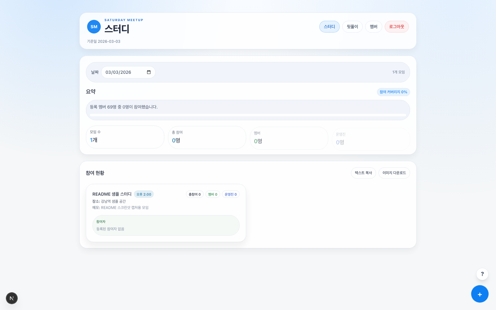
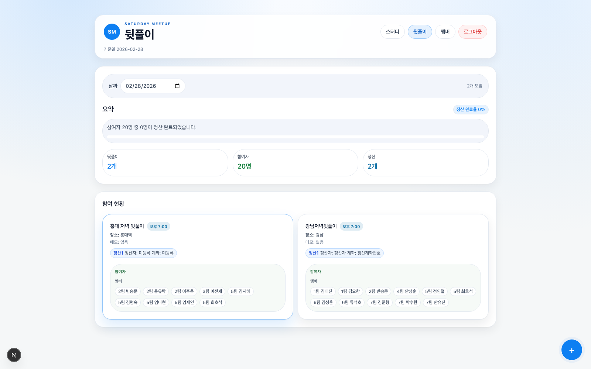

# Saturday Meetup Dashboard

토요일 오프라인 스터디 운영을 위해 만든 관리 대시보드입니다.
목표는 "누가 어디에 참여했는지"를 날짜 기준으로 빠르게 파악하고,
모임/뒷풀이/정산까지 한 흐름으로 관리하는 것입니다.

## 프로젝트 개요

- 운영 화면을 스터디/뒷풀이/멤버 관리로 분리해 흐름을 단순화했습니다.
- 날짜 단위로 모임 상태를 조회하고, 상세 화면에서 참여자와 정산 상태를 즉시 갱신합니다.
- 팀/운영진 기준 빠른 추가를 통해 반복 입력 없이 현장 운영 속도를 높입니다.
- 멤버 프리셋(팀/운영진)을 중심으로 스터디와 뒷풀이 데이터를 연결해 관리합니다.

## 아키텍처 및 기술 스택

- 아키텍처
  - Frontend: Next.js App Router 기반 서버 렌더링 + 서버 액션
  - Data Layer: PostgreSQL(`pg`) 기반 저장소
  - Cache: `unstable_cache` + `revalidateTag`/`revalidatePath` 조합
- 기술 스택
  - Next.js 16 + TypeScript
  - React 19
  - PostgreSQL (`pg`)
  - Tailwind CSS

## 스크린샷 (샘플 데이터)

### 스터디 대시보드

### 뒷풀이 대시보드

## 핵심 기능

### 1) 오프라인 스터디 관리

- 날짜별 스터디 모임 카드 조회
- 모임별 참여자(멤버/운영진 역할) 시각 분리
- 상세 페이지에서 참여자 추가/수정/삭제
- 모임 정보 수정/삭제

### 2) 뒷풀이 관리

- 날짜별 뒷풀이 카드 조회
- 카드에서 참여자 이름, 정산자, 정산 계좌 표시
- 상세 페이지에서 참여자 추가/삭제
- 참여자별 정산 상태 토글(정산 완료/미정산)

### 3) 팀 기반 빠른 추가

- 팀 이름 필터(전체/팀별/운영진)
- 이름 클릭 즉시 참여자 추가
- 각 이름 옆에 현재 참여 여부 + 연결된 모임 뱃지 표시
  - `스터디 · 모임명`
  - `뒷풀이 · 모임명`

### 4) 스터디/뒷풀이 연동

- 팀 할당 현황에서 스터디와 뒷풀이 참여 이력을 함께 확인
- 페이지 탭 이동 시 날짜 컨텍스트 유지

### 5) 멤버 구성 편집

- 팀 추가/삭제
- 팀 엔젤/멤버 목록 수정
- 엔젤 디렉터리 관리
- 운영진 역할(서포터/버디/멘토/매니저) 디렉터리 관리
- 자동 저장 상태 표시(저장 중/완료/실패)

## 업데이트 내역

### 2026-03-01

- 스터디/뒷풀이 상세의 사이드패널 빠른 추가 폼에 `mutationSource`를 연결해, 빠른 추가 시 불필요한 대시보드 경로 재검증을 건너뛰도록 조정했습니다.
- 사이드패널 이름 클릭 추가 버튼에 `추가중...` pending 상태를 표시해, 네트워크 지연 구간에서도 진행 상태를 확인할 수 있도록 개선했습니다.

### 2026-02-26

- 오프라인 스터디/뒷풀이 상세의 참여자 관리 UI를 통일하고, 역할이 있는 참여자를 이모지와 함께 단일 리스트로 표시하도록 정리했습니다.
- `팀 할당 현황 · 멤버 추가` 영역을 `오프라인 스터디 참여자 관리`로 정리하고, `운영진`을 가상 팀으로 포함해 팀 필터/빠른 추가에서 동일하게 동작하도록 맞췄습니다.
- 스터디 집계 로직을 역할 확장 기준으로 수정해 `멤버(student)`와 `운영진(non-student)` 집계가 일관되게 반영되도록 정리했습니다.
- 대시보드/상세/공유 텍스트의 표기를 `엔젤` 단일 용어에서 `운영진` 기준으로 통일했습니다.
