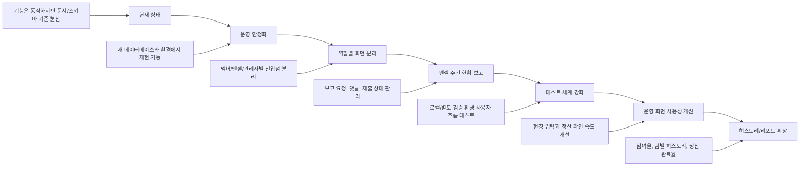
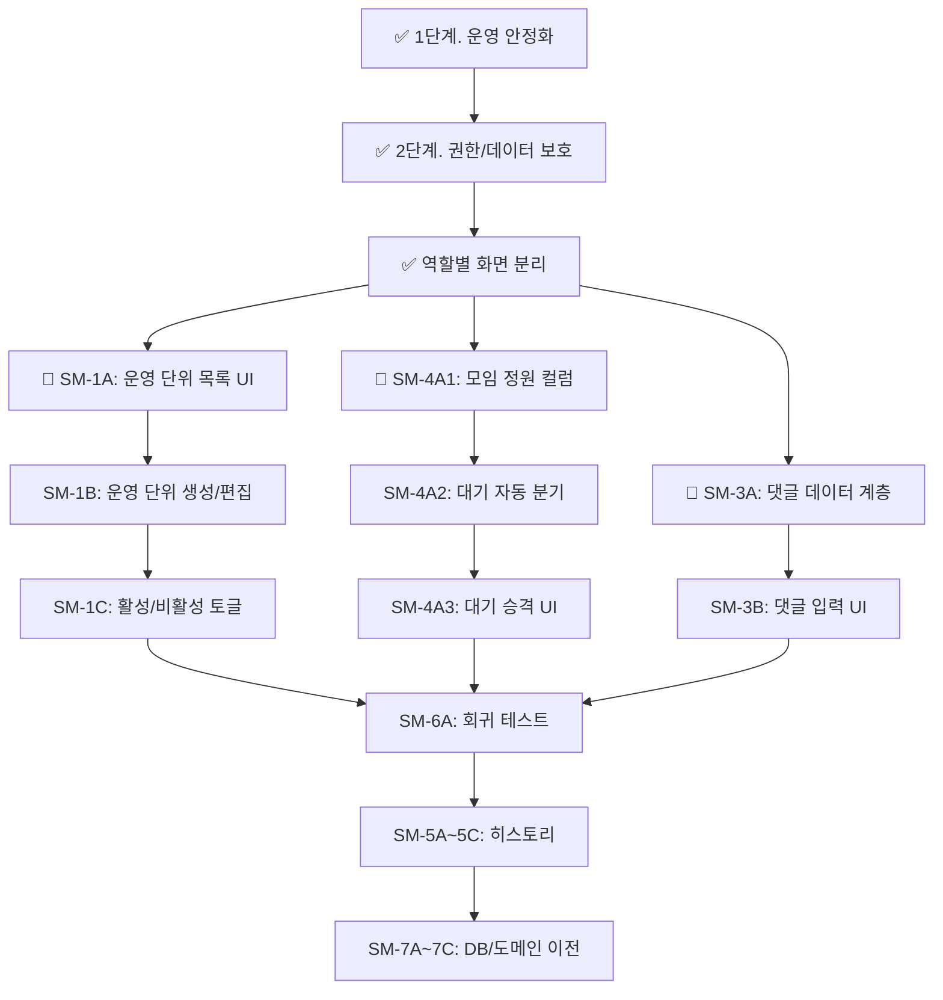

# Saturday Meetup 개선 계획

작성일: 2026-04-26  
최종 업데이트: 2026-05-01

## 1. 개선 방향

현재 제품은 핵심 운영 흐름이 이미 돌아가는 상태다. 다음 개발은 새 기능을 많이 붙이는 것보다, 안정적으로 운영하고 안전하게 확장할 수 있는 기반을 만드는 방향이 맞다.

우선순위는 다음과 같다.

1. 새 환경에서 제품을 재현할 수 있게 만들기 ✅
2. 운영 데이터와 테스트 데이터를 분리하기 ✅
3. 멤버, 엔젤, 관리자 화면을 역할별로 나누기 ✅
4. 엔젤 주간 현황 보고를 제품 안에서 관리하기 🔄 (기본 완료, 댓글/공유 미완)
5. 비밀번호와 권한 경계를 더 안전하게 만들기 ✅
6. 화면과 액션 구조를 정리해 변경 비용 줄이기 🔄
7. 참여/정산 데이터를 리포트로 확장하기 ⬜

## 2. 목표 상태

## 3. 역할별 화면 구상 ✅ 완료

### 기본 방향

모임과 뒷풀이는 모두가 볼 수 있는 공용 운영 영역으로 둔다. 반면 엔젤 주간 현황 보고와 관리자 판단이 필요한 내용은 멤버가 접근하기 어렵도록 별도 화면과 권한을 둔다.

| 화면 | 주 사용자 | 접근 가능한 내용 |
| --- | --- | --- |
| 멤버 전용 페이지 | 멤버 | 오프라인 모임 확인, 참석 등록, 뒷풀이 확인, 뒷풀이 참여 |
| 엔젤 전용 페이지 | 엔젤, 서포터, 운영진 | 공용 모임/뒷풀이, 담당 팀 현황 보고 작성, 관리자 게시물 확인, 댓글 작성 |
| 관리자 전용 페이지 | 관리자 | 기수/팀/역할 관리, 엔젤 보고 요청 생성, 제출 현황 확인, 보고 내용 검토, 공유용 보고문 생성 |
| 공용 모임 페이지 | 멤버, 엔젤, 서포터, 운영진, 관리자 | 날짜별 스터디 모임, 참여자, 장소, 뒷풀이, 정산 상태 |

### 구현 현황 (2026-05-01 기준)

- ✅ `/member` 라우트: 멤버 전용 페이지
- ✅ `/angel` 라우트: 엔젤 전용 페이지 (보고 작성 포함)
- ✅ `/admin` 라우트: 관리자 전용 페이지
- ✅ `role-session.ts`: 역할별 비밀번호 인증 + 쿠키 세션 (timingSafeEqual 사용)
- ✅ `role-shell.tsx`: 역할별 공통 레이아웃 셸
- ✅ `feature-flags.ts`: feature flag 인프라 (`isOperatingUnitsEnabled()`)
- 🔄 운영 단위(operating_unit_slug) 연동: store 계층 완료, UI 게이트 미연결

## 4. 1단계. 운영 안정화 기준선 ✅ 완료

### 목표

프로젝트 안내 문서와 데이터베이스 문서만 보고 새 환경에서 제품을 안전하게 실행할 수 있게 한다.

### 완료된 작업

- ✅ 현재 제품 기준으로 데이터베이스 초기 구조 문서 갱신 (`docs/db/01_init_schema.sql`)
- ✅ 스터디, 뒷풀이, 정산, 멤버 프리셋 데이터 구조를 한 문서에 정리
- ✅ 런타임 스키마 보정 정책 정리 (`ensureSchema()` 패턴)
- ✅ 필수 환경변수 문서화 (`.env.example`)
- ✅ 운영 데이터 백업 스크립트 (`scripts/backup-db.mjs`, `npm run db:backup`)
- ✅ DB 연결 확인 스크립트 (`scripts/db-ping.mjs`, `npm run db:ping`)
- ✅ 품질 게이트 스크립트 (`scripts/quality-harness.mjs`)
- ✅ typecheck npm script 추가 (`npm run typecheck`)

## 5. 2단계. 권한과 데이터 보호 정리 ✅ 완료

### 목표

내부 도구의 빠른 사용성은 유지하되, 역할별로 볼 수 있는 내용을 나누고 운영 데이터 보호 수준을 올린다.

### 완료된 작업

- ✅ 공용 비밀번호, 개별 모임 비밀번호, 마스터 오버라이드의 역할 명확히 정의
- ✅ 멤버, 엔젤, 관리자 화면의 접근 기준 정의 및 구현
- ✅ 엔젤 보고와 관리자 게시물이 멤버 화면에 노출되지 않도록 분리
- ✅ `role-session.ts`: `timingSafeEqual` 기반 안전한 비밀번호 검증
- ✅ 삭제/수정 작업의 비밀번호 보호 흐름

### 남은 작업

- ⬜ 민감한 값이 테스트 상태나 문서에 남지 않도록 점검
- ⬜ 운영 데이터 백업 복구 절차 검증 (backup은 있으나 restore 미문서화)

## 6. 3단계. 엔젤 주간 현황 보고 🔄 진행 중

### 목표

슬랙에 매번 흩어져 올라가는 엔젤 주간 현황 보고를 제품 안에서 작성, 댓글, 검토, 공유할 수 있게 한다.

### 완료된 작업 (2026-05-01 기준)

- ✅ `weekly_report_cycles` 테이블 + CRUD
- ✅ `weekly_report_templates` 테이블 + CRUD
- ✅ `angel_weekly_reports` 테이블 + 보고 작성/조회
- ✅ `/admin/reports/cycles/` — 관리자 보고 요청 생성 + 제출 현황
- ✅ `/angel/reports/[cycleId]/teams/[teamName]/` — 엔젤 보고 작성 화면
- ✅ `weekly-report-actions.ts` — server actions

### 남은 작업 (backlog.json 참조)

- ⬜ SM-3A: `weekly_report_comments` 테이블 + `listComments/addComment/softDeleteComment`
- ⬜ SM-3B: 엔젤 보고 화면 댓글 입력 UI
- ⬜ SM-3C: 주간 보고 슬랙 공유 문구 빌더 (`buildCycleShareText`)

## 7. 4단계. 구조 정리 🔄 진행 중

### 목표

다음 기능 추가가 기존 동작을 깨뜨리지 않도록 제품 영역별 책임을 분리한다.

### 완료된 작업

- ✅ 멤버 전용, 엔젤 전용, 관리자 전용 화면 분리
- ✅ `role-shell.tsx` / `role-page-view.tsx` 공통 레이아웃 패턴
- ✅ 운영 단위(`operating_unit_slug`) 컬럼을 meetings/afterparties/member 테이블에 추가

### 남은 작업 (backlog.json 참조)

- ⬜ SM-1A: `/admin/operating-units` 목록 라우트 + 카드 연결
- ⬜ SM-1B: 운영 단위 생성/편집 form + server action
- ⬜ SM-1C: is_active 컬럼 + 비활성 단위 보호
- ⬜ SM-4A1~4A3: 모임 정원/대기 시스템

## 8. 5단계. 테스트 체계 강화 ⬜ 미착수

### 목표

운영에 중요한 흐름을 반복 검증할 수 있게 한다.

### 작업 (backlog.json 참조)

- ⬜ SM-6A: 기존 흐름 회귀 Playwright 시나리오 (모임 생성/참석/취소, 뒷풀이/정산)
- ⬜ SM-6B: 모바일 뷰 + 접근성 점검
- ⬜ SM-6C: Feature flag ON/OFF 매트릭스 검증

## 9. 6단계. 운영 화면 사용성 개선 ⬜ 미착수

### 목표

현장에서 빠르게 입력하고, 실수를 찾고, 공유할 수 있게 만든다.

### 작업

- 모바일 화면에서 날짜 선택, 참여자 추가, 정산 토글 사용성 점검
- 참여자 중복 추가, 역할 자동 변경, 입력 실패 피드백 개선
- 정산별 미정산자 필터 추가 검토
- 정산 공유 텍스트 개선
- 장소 링크 추출과 표시 방식 개선 (SM-4B1)
- 멤버 프리셋 자동 저장 실패 시 복구 흐름 개선
- 엔젤 보고 작성 화면에서 임시 저장과 제출 상태를 명확히 표시
- 관리자 화면에서 미제출 팀과 최근 댓글을 빠르게 확인

## 10. 7단계. 히스토리와 리포트 확장 ⬜ 미착수

### 목표

운영 입력 데이터를 회고와 개선에 쓸 수 있는 정보로 전환한다.

### 후보 기능 (backlog.json SM-5A~5C 참조)

- 기간별 참여율 요약
- 팀별 참여 히스토리
- 운영진 역할별 참여 현황
- 엔젤 보고 제출 이력
- 팀별 반복 이슈 이력
- 뒷풀이 참여율
- 정산 완료율
- 공유용 텍스트 또는 표 파일 내보내기

## 11. 이번 계획에서 제외할 것

- 매주 반복 모임을 자동 생성하는 기능은 우선순위에서 제외한다.
- 학생이 복잡한 보고 기능을 쓰게 만드는 방향은 피한다.
- 처음부터 슬랙 자동 전송까지 만들기보다, 우선은 슬랙에 붙여넣기 좋은 문구 생성부터 시작한다.

## 12. 현재 진행 순서 (2026-05-01 기준)

